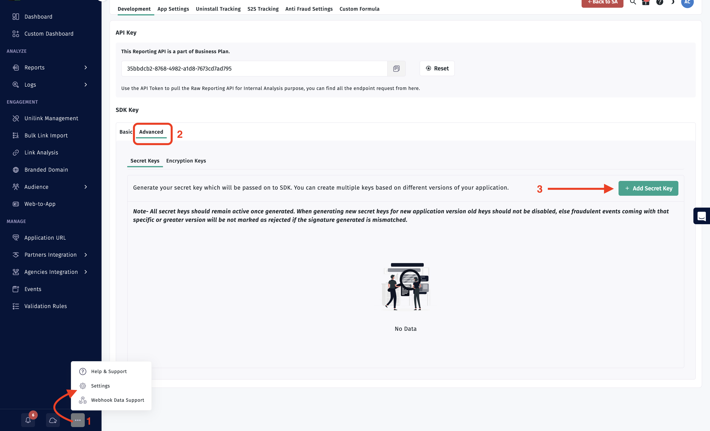
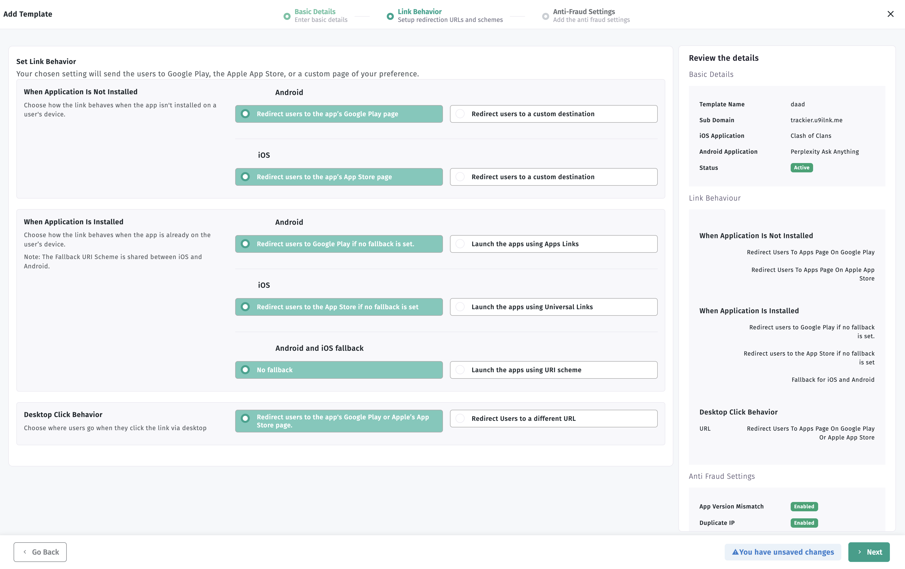

# apptrove-expo-sdk

this is apptrove expo and react-native package

## Table of Contents

* [Quick Integration Guide](#qs-basic-integration)
    * [Installation](#qs-basic-integration)
    * [Dependencies](#dependencies)
    * [Retrieve your app token](#qs-retrieve-app-token)
    * [Getting Google Advertising ID](#qs-getting-gaid)
    * [Initialize the SDK](#qs-initialize-sdk)
    * [Events Tracking](#qs-track-events)
    * [Revenue Events Tracking](#qs-track-event-with-currencey)
    * [Pass the custom params in events](#qs-add-custom-parms-event)
    * [Passing User Data to SDK](#qs-passing-user-data)
    * [SDK Signing](#qs-sdk-signing)
    * [Track Uninstall for Android](#qs-track-uninstall-android)
* [Deep linking](#qs-deeplink)
* [Getting Campaign Data](#qs-campaign-data)
* [Proguard Settings](#qs-progaurd-settings)


## <a id="qs-add-apptrove-sdk"></a>Quick Integration Guide

We have created an example app for the react-native SDK integration. 

Please check the [Example](https://github.com/ApptroveLabs/trackier-expo-sdk/tree/main/example) directory to know how the `AppTrove SDK` can be integrated.


## <a id="qs-basic-integration"></a>Integrate React-Native SDK to your app

For integration, you need to import the apptrove library in your project. 

For importing the library in project, you need to run the below command in the `terminal/cmd`.

For Npm
```sh
$ npm i apptrove-expo-sdk
```
For Yarn
```sh
$ yarn add apptrove-expo-sdk
```

For iOS app, make sure to go to ios folder and install CocoaPods dependencies:

```sh
$ cd ios && pod install
```

### Expo Config Plugin

If you're using Expo, the SDK includes a config plugin that automatically configures your project. Add the plugin to your `app.json` or `app.config.js`:

```json
{
  "plugins": [
    "apptrove-expo-sdk"
  ]
}
```

The plugin will automatically:
- Add the required Android dependency (`com.google.android.gms:play-services-ads-identifier:18.0.1`)
- Add the iOS pod (`apptrove-ios-sdk`) to your Podfile

After adding the plugin, run:
```sh
$ npx expo prebuild
```

### Dependencies

The AppTrove Expo SDK requires the following dependencies:

#### Peer Dependencies
- `react`: `*` (any version)
- `react-native`: `*` (any version)

These are automatically installed when you install `apptrove-expo-sdk`.

#### Android Dependencies

The following dependencies are required for Android and will be automatically added by the Expo config plugin, or you can add them manually:

```gradle
dependencies {
  // AppTrove Android SDK (required)
  implementation 'com.apptrove:android-sdk:2.0.0'
  
  // Google Play Services for Advertising ID (required)
  implementation 'com.google.android.gms:play-services-ads-identifier:18.0.1'
  
  // Install Referrer Library (required)
  implementation 'com.android.installreferrer:installreferrer:2.2'
}
```

**Note:** The AppTrove Android SDK (`com.apptrove:android-sdk:2.0.0`) is available on [Maven Central](https://mvnrepository.com/artifact/com.apptrove/android-sdk).

#### iOS Dependencies

The following CocoaPod is required for iOS and will be automatically added by the Expo config plugin, or you can add it manually to your `Podfile`:

```ruby
pod 'apptrove-ios-sdk'
```

After adding the pod, run:
```sh
$ cd ios && pod install
```

**Note:** The AppTrove iOS SDK (`apptrove-ios-sdk`) is available on CocoaPods.

#### Expo Config Plugin Dependency

If you're using the Expo config plugin, ensure you have `@expo/config-plugins` installed (it's included as a devDependency in this package, but you may need it in your Expo project):

```sh
$ npm install @expo/config-plugins
# or
$ yarn add @expo/config-plugins
```

## <a id="qs-getting-gaid"></a> Getting Google Advertising ID

AppTrove SDK need the advertising id from the application. 

For achieving this, you need to add some line of code in the build.gradle and also in Manifest.xml for read the Advertising id from the application which is mentioned below

- Add the required dependencies in your app **build.gradle**

```gradle
dependencies {
  // AppTrove Android SDK (required)
  implementation 'com.apptrove:android-sdk:2.0.0'
  
  // Google Play Services for Advertising ID (required)
  implementation 'com.google.android.gms:play-services-ads-identifier:18.0.1'
  
  // Install Referrer Library (required)
  implementation 'com.android.installreferrer:installreferrer:2.2'
}
```

**Note:** 
- If you're using the Expo config plugin, the `play-services-ads-identifier` dependency will be added automatically. You still need to manually add the AppTrove Android SDK (`com.apptrove:android-sdk:2.0.0`) and install referrer dependencies.
- The AppTrove Android SDK is available on [Maven Central](https://mvnrepository.com/artifact/com.apptrove/android-sdk).

Also update the gradle.properties file by adding this lines in case the gradle version is lower than 7.0

```gradle
android.jetifier.blacklist=moshi-1.13.0.jar
```
- Update your Android Manifest file by adding the following permission. This is required if your app is targeting devices with android version 12+

```xml
<uses-permission android:name="com.google.android.gms.permission.AD_ID"/>
```

- Add meta data inside the application tag (If not already added)
```xml
<meta-data
            android:name="com.google.android.gms.version"
            android:value="@integer/google_play_services_version" /> // Add this meta-data in the manifest.xml under Application tag.
```
Below are the screenshot of application tag in manifest.xml for the reference

Screenshot[1]


### <a id="qs-retrieve-app-token"></a>Retrieve your app token

1. Login to your AppTrove MMP account.
2. Select the application from dashboard which you want to get the app token for.
3. Go to SDK Integration via the left side navigation menu.
4. Copy the SDK Key there to be used as the `"app_token"`.


### <a id="qs-initialize-sdk"></a>SDK integration in app

You should use the following import statement on top of your `.js` file:
```tsx
import { AppTroveConfig, AppTroveSDK, AppTroveEvent } from 'apptrove-expo-sdk';
```

In your `App.tsx` file, add the following code to initialize the AppTrove SDK:
```tsx

import { useState, useEffect } from 'react';
import { StyleSheet, Text, View, TouchableHighlight, NativeEventEmitter, NativeModules} from 'react-native';
import { AppTroveConfig, AppTroveSDK, AppTroveEvent } from 'apptrove-expo-sdk';

export default function App() {

  useEffect(() => {

    const apptroveConfig = new AppTroveConfig("ee9f21fb-xxxx-xxxx-xxxc-e4093e6d220c", AppTroveConfig.EnvironmentDevelopment);
    apptroveConfig.setAppSecret("640710587f4xxxxac0cb370", "9e043b7e-xxxx-xxxx-xxxx-8cf6bfe8daa0");
    apptroveConfig.setDeferredDeeplinkCallbackListener((uri: string) => {
        console.log("Deferred Deeplink Callback received");
        console.log("URL: " + uri);
    });
  
    AppTroveSDK.initialize(apptroveConfig);
 
  }, []);
}
```

Depending on whether you build your app for testing or for production, you must set the environment with one of these values:
```tsx
AppTroveConfig.EnvironmentTesting
AppTroveConfig.EnvironmentDevelopment
AppTroveConfig.EnvironmentProduction
```


### <a id="qs-track-events"></a>Events Tracking

<a id="qs-retrieve-event-id"></a>AppTrove events trackings enable to provides the insights into how to user interacts with your app. 
AppTrove SDK easily get that insights data from the app. Just follow with the simple events integration process

AppTrove provides the `Built-in events` and `Customs events` on the AppTrove panel.

#### **Built-in Events** - 

Predefined events are the list of constants events which already been created on the dashboard. 

You can use directly to track those events. Just need to implements events in the app projects.

Screenshot[2]


### Example code for calling Built-in events

```tsx

import { useState, useEffect } from 'react';
import { StyleSheet, Text, View, TouchableHighlight, NativeEventEmitter, NativeModules} from 'react-native';
import { AppTroveConfig, AppTroveSDK, AppTroveEvent } from 'apptrove-expo-sdk';

export default function App() {

  useEffect(() => {

    const apptroveConfig = new AppTroveConfig("ee9f21fb-xxxx-xxxx-xxxxx-e4093e6d220c", AppTroveConfig.EnvironmentDevelopment);
    apptroveConfig.setAppSecret("640710587xxxxxxac0cb370", "9e043b7e-7f44-xxx-xxxxx-8cf6bfe8daa0");
    apptroveConfig.setDeferredDeeplinkCallbackListener((uri: string) => {
        console.log("Deferred Deeplink Callback received");
        console.log("URL: " + uri);
    });
  
    AppTroveSDK.initialize(apptroveConfig);
 
  }, []);

  function _onPress_trackSimpleEvent(){
    var apptroveEvent = new AppTroveEvent(AppTroveEvent.ADD_TO_CART);
    apptroveEvent.param1 = "XXXXXX";
    apptroveEvent.param2 = "kkkkkk";
    apptroveEvent.couponCode = "testReact";
    apptroveEvent.discount = 2.0;
    AppTroveSDK.setUserName('abc');
    AppTroveSDK.setUserPhone("813434721");
    AppTroveSDK.setUserId("67863872382");
    const customData = new Map();
    customData.set("name", "sanu");
    customData.set("phone", "8130300784");
    var jsonData = { "url": "+91-8130300721" ,  "name": "Embassies" };
    apptroveEvent.ev = jsonData;
    AppTroveSDK.trackEvent(apptroveEvent);
  }
}
```


#### **Customs Events** - 

Customs events are created by user as per their required business logic. 

You can create the events in the AppTrove dashboard and integrate those events in the app project.

Screenshot[3]


### Example code for calling Customs Events.

```tsx

import { useState, useEffect } from 'react';
import { StyleSheet, Text, View, TouchableHighlight, NativeEventEmitter, NativeModules} from 'react-native';
import { AppTroveConfig, AppTroveSDK, AppTroveEvent } from 'apptrove-expo-sdk';

export default function App() {

  useEffect(() => {

    const apptroveConfig = new AppTroveConfig("ee9f21fb-xxxx-xxxx-xxxxx-e4093e6d220c", AppTroveConfig.EnvironmentDevelopment);
    apptroveConfig.setAppSecret("640710587xxxxxxac0cb370", "9e043b7e-7f44-xxx-xxxxx-8cf6bfe8daa0");
    apptroveConfig.setDeferredDeeplinkCallbackListener((uri: string) => {
        console.log("Deferred Deeplink Callback received");
        console.log("URL: " + uri);
    });
  
    AppTroveSDK.initialize(apptroveConfig);
 
  }, []);

  function _onPress_trackSimpleEvent(){
    var apptroveEvent = new AppTroveEvent("sEMWSCTXeu");//pass your event id here
    apptroveEvent.param1 = "XXXXXX";
    apptroveEvent.param2 = "kkkkkk";
    apptroveEvent.couponCode = "testReact";
    apptroveEvent.discount = 2.0;
    AppTroveSDK.setUserName('abc');
    AppTroveSDK.setUserPhone("813434721");
    AppTroveSDK.setUserId("67863872382");
    const customData = new Map();
    customData.set("name", "sanu");
    customData.set("phone", "8130300784");
    var jsonData = { "url": "+91-8130300721" ,  "name": "Embassies" };
    apptroveEvent.ev = jsonData;
    AppTroveSDK.trackEvent(apptroveEvent);
  }
}
```
   


### <a id="qs-track-event-with-currencey"></a>Revenue Event Tracking

AppTrove allow user to pass the revenue data which is generated from the app through Revenue events. It is mainly used to keeping record of generating revenue from the app and also you can pass currency as well.

```tsx
    
import { useState, useEffect } from 'react';
import { StyleSheet, Text, View, TouchableHighlight, NativeEventEmitter, NativeModules} from 'react-native';
import { AppTroveConfig, AppTroveSDK, AppTroveEvent } from 'apptrove-expo-sdk';

export default function App() {

  useEffect(() => {

    const apptroveConfig = new AppTroveConfig("ee9f21fb-xxxx-xxxx-xxxxx-e4093e6d220c", AppTroveConfig.EnvironmentDevelopment);
    apptroveConfig.setAppSecret("640710587xxxxxxac0cb370", "9e043b7e-7f44-xxx-xxxxx-8cf6bfe8daa0");
    apptroveConfig.setDeferredDeeplinkCallbackListener((uri: string) => {
        console.log("Deferred Deeplink Callback received");
        console.log("URL: " + uri);
    });
  
    AppTroveSDK.initialize(apptroveConfig);
 
  }, []);

  function _onPress_trackSimpleEvent(){
    var apptroveEvent = new AppTroveEvent("sEMWSCTXeu");
   //Passing the revenue events be like below example

    revenueEvent.revenue = 2.5; //Pass your generated revenue here.
    revenueEvent.currency = "USD"; //Pass your currency here.
    AppTroveSDK.trackEvent(apptroveEvent);
  }
}

```


### <a id="qs-add-custom-parms-event"></a>Pass the custom params in events

```tsx

  import { useState, useEffect } from 'react';
import { StyleSheet, Text, View, TouchableHighlight, NativeEventEmitter, NativeModules} from 'react-native';
import { AppTroveConfig, AppTroveSDK, AppTroveEvent } from 'apptrove-expo-sdk';

export default function App() {

  useEffect(() => {

    const apptroveConfig = new AppTroveConfig("ee9f21fb-xxxx-xxxx-xxxxx-e4093e6d220c", AppTroveConfig.EnvironmentDevelopment);
    apptroveConfig.setAppSecret("640710587xxxxxxac0cb370", "9e043b7e-7f44-xxx-xxxxx-8cf6bfe8daa0");
    apptroveConfig.setDeferredDeeplinkCallbackListener((uri: string) => {
        console.log("Deferred Deeplink Callback received");
        console.log("URL: " + uri);
    });
  
    AppTroveSDK.initialize(apptroveConfig);
 
  }, []);

  function _onPress_trackSimpleEvent(){
    var apptroveEvent = new AppTroveEvent("sEMWSCTXeu");
    var jsonData = { "url": "+91-8130300721" ,  "name": "Embassies" };
    apptroveEvent.ev = jsonData;
    AppTroveSDK.trackEvent(apptroveEvent);
  }
}
  }
```

- First create a map.
- Pass its reference to apptroveEvent.ev param of event.
- Pass event reference to trackEvent method of AppTroveSDK.


### <a id="qs-passing-user-data"></a>Passing User Data to SDK

AppTrove allows to pass additional data like Userid, Email to SDK so that same can be correlated to the AppTrove Data and logs.

Just need to pass the data of User Id, Email Id and other additional data to AppTrove SDK function which is mentioned below:-


```js

function _userDetails(){
    var apptroveEvent = new AppTroveEvent(AppTroveEvent.ADD_TO_CART);
    //Passing the data as mentioned below 
    AppTroveSDK.setUserId("XXXXXXXX"); //Pass the UserId values here
    AppTroveSDK.setUserEmail("abc@gmail.com"); //Pass the user email id in the argument.
    AppTroveSDK.setUserName("abc");
    AppTroveSDK.setUserPhone("813434721");
    AppTroveSDK.trackEvent(apptroveEvent);
}
```

### For Passing Additional Data

AppTrove allow for passing the additional user details like UserName, Mobile Number, UserAge, UserGender etc. . You need to first make a hashmap and pass it in setUserAdditionalDetail function. The example are in mentioned below


```js

  function _userDetails(){
    var apptroveEvent = new AppTroveEvent(AppTroveEvent.ADD_TO_CART);
    //Passing the data as mentioned below 
    AppTroveSDK.setUserId("XXXXXXXX"); //Pass the UserId values here
    AppTroveSDK.setUserEmail("abc@gmail.com"); //Pass the user email id in the argument.
    AppTroveSDK.setUserName("abc");
    AppTroveSDK.setUserPhone("813434721");
    var jsonData = {"phone": "+91-8137872378" , "name": "Embassies"};
    AppTroveSDK.setUserAdditionalDetails(jsonData)
    AppTroveSDK.trackEvent(apptroveEvent);
  }
```

Below are the screenshots of the customs data passing 


## <a id="qs-sdk-signing"></a>SDK Signing 

Following below are the steps to retrieve the secretId and secretKey :-

- Login your AppTrove Panel and select your application.
- In the Dashboard, click on the `... -> Settings` option on the left side of panel. 
- Under on the SDK Integration, click on the Advanced tab. 
- Under the Advanced tab, you will get the secretId and secretKey.

Please check on the below screenshot

Screenshot[4]




Check below the example code for passing the secretId and secretKey to the SDK

```tsx

import { useState, useEffect } from 'react';
import { StyleSheet, Text, View, TouchableHighlight, NativeEventEmitter, NativeModules} from 'react-native';
import { AppTroveConfig, AppTroveSDK, AppTroveEvent } from 'apptrove-expo-sdk';

export default function App() {

  useEffect(() => {

    const apptroveConfig = new AppTroveConfig("ee9f21fb-xxxx-xxxx-xxxxx-e4093e6d220c", AppTroveConfig.EnvironmentDevelopment);
    apptroveConfig.setAppSecret("640710587xxxxxxac0cb370", "9e043b7e-7f44-xxx-xxxxx-8cf6bfe8daa0"); //SDK Signing
    apptroveConfig.setDeferredDeeplinkCallbackListener((uri: string) => {
        console.log("Deferred Deeplink Callback received");
        console.log("URL: " + uri);
    });
  
    AppTroveSDK.initialize(apptroveConfig);
 
  }, []);
}

}

```

### <a id="qs-track-uninstall-android"></a> Track Uninstall for Android

 **Before you begin**
* [Install `firebase_core`](https://rnfirebase.io/analytics/usage) and add the initialization code to your app if you haven't already.
* Add your app to your Firebase project in the [Firebase console](https://console.firebase.google.com/).

#### Add the Analytics SDK to your app


* Once installed, you can access the `firebase_analytics` plugin by importing it in your JS code:
  ```js
    import analytics from '@react-native-firebase/analytics';
  ```
* Create a new Firebase Analytics instance by with this code
  ```js
    var analytics = analytics();
  ```
* Use the `analytics` instance obtained above to set the following user property:
  ```js
    var apptroveId = await AppTroveSDK.getAppTroveId();
    await analytics().setUserProperty('ct_objectId', apptroveId); 
  ``` 

* Adding the above code to your app sets up a common identifier. 
* Set the `app_remove` event as a conversion event in Firebase. 
* Use the Firebase cloud function to send uninstall information to AppTrove MMP. 
* You can find the support article [here](https://help.apptrove.com/support/solutions/articles/31000162841-android-uninstall-tracking).


### <a id="qs-deeplink"></a> Deep linking 

Deep linking is a techniques in which the user directly redirect to the specific pages of the application by click on the deeplink url.

There are two types deeplinking

* ***Normal deeplinking*** - Direct deep linking occurs when a user already has your app installed on their device. When this is the case, the deep link will redirect the user to the screen specified in the link.

* ***Deferred deeplinking*** - Deferred deep linking occurs when a user does not have your app installed on their device. When this is the case, the deep link will first send the user to the device app store to install the app. Once the user has installed and opened the app, the SDK will redirect them to the screen specified in the link.

Please check below the Deeplinking scenario 


### Normal Deep linking for Android

If a user already has your app on their device, it will open when they interact with a tracker containing a deep link. You can then parse the deep link information for further use. To do this, you need to choose a desired unique scheme name.

You can set up a specific activity to launch when a user interacts with a deep link. To do this:

* Assign the unique scheme name to the activity in your AndroidManifest.xml file.
* Add the intent-filter section to the activity definition.
* Assign an android:scheme property value with your preferred scheme name.

For example, you could set up an activity called FirstActivity to open like this:
#### AndroidManifest.xml 

```

        <activity
            android:name=".Activity.FirstProduct"
            android:exported="true">
        <intent-filter>
            <action android:name="android.intent.action.VIEW" />
            <category android:name="android.intent.category.DEFAULT" />
            <category android:name="android.intent.category.BROWSABLE" />
            <data
                android:host="apptrove.u9ilnk.me"
                android:pathPrefix="/product"
                android:scheme="https" />
        </intent-filter>
        </activity>

```

```
https://apptrove.u9ilnk.me/product?dlv=FirstProduct&quantity=10&pid=sms
```

### Normal Deep linking Setup for iOS
    
There is a Universal Links iOS app opening method which needs to be implemented for deeplink to work. This method directly opens the mobile app at default activity. Universal links take the format of normal web links for example. https://yourbrand.com or https://yourbrand.u9ilnk.me

Follow the steps for configuring Universal Links

**a. Getting the app bundle ID and prefix ID**

1. Log into your Apple Developer Account.
2. On the left-hand menu, select Certificates, IDs & Profiles.
3. Under Identifiers, select App IDs.
4. Click the relevant app.
5. Copy the prefix ID and app bundle ID and insert in app settings page in AppTrove.

Screenshot[5]


**b. Adding the prefix ID and app bundle ID in the AppTrove MMP.**

- Login your AppTrove Panel
- Select your application and click on Action button and login as
- In the Dashboard, Click on the `UniLink` option on the left side of panel.
- On the Unilink page, create template by click on Action button which is located on the right side header of the page.
- After creating template, Edit that template by click on the edit button.
- On the edit template page, Add the prefix ID and app bundle ID in the **Link Behaviour (When application is installed)**

Please check the screenshot for the reference

Screenshot[6]



**c. Configure mobile apps to register associated domains**

Configuring mobile apps to register approved domains takes place inside Xcode. It requires the unilink subdomain that you can get from app setting page in AppTrove MMP.

1. Follow this [iOS instructions](https://developer.apple.com/documentation/xcode/supporting-associated-domains)
2. Get the unilink subdomain from app settings page in AppTrove MMP.
3. In Xcode, click on your project. Click on the project target.
4. Switch to Capabilities tab.
5. Turn on Associated Domain.
6. Add the unilink subdomain that you got from AppTrove MMP.
7. The format is applinks:subdomain.unilink.me. Add **applinks:** before the domain as like `applinks:subdomain.unilink.me`

Screenshot[7]


To associate a domain with your app, you need to have the associated domain file on your domain and the appropriate entitlement in your app. Once the unilink is created, AppTrove hosts the apple-app-site-association file. When a user installs your app, the system attempts to download the associated domain file and verify the domains in your Associated Domains Entitlement.


### Deferred Deep linking

Deferred deep linking happened, when a user does not have your app installed on their device. When the user clicks a apptrove URL, the URL will redirect them to the Play Store to download and install your app. When the user opens the app for the first time, the SDK will read the deep_link content.

The AppTrove SDK opens the deferred deep link by default. just need to add some code in application class just after initilazation of AppTrove SDk

Below are the example of the code :-

```tsx

import { useState, useEffect } from 'react';
import { StyleSheet, Text, View, TouchableHighlight, NativeEventEmitter, NativeModules} from 'react-native';
import { AppTroveConfig, AppTroveSDK, AppTroveEvent } from 'apptrove-expo-sdk';

export default function App() {

  useEffect(() => {

    const apptroveConfig = new AppTroveConfig("ee9f21fb-xxxx-xxxx-xxxxx-e4093e6d220c", AppTroveConfig.EnvironmentDevelopment);
    apptroveConfig.setAppSecret("640710587xxxxxxac0cb370", "9e043b7e-7f44-xxx-xxxxx-8cf6bfe8daa0"); //SDK Signing
    apptroveConfig.setDeferredDeeplinkCallbackListener((uri: string) => {
        console.log("Deferred Deeplink Callback received");
        console.log("URL: " + uri);
    });
  
    AppTroveSDK.initialize(apptroveConfig);
 
  }, []);
}


```
## <a id="qs-campaign-data"></a>Getting Campaign Data
For getting the campaign data, We have a function that return the campaign data. Please check below the example code.

```js

function _onPress_trackSimpleEvent(){
    var apptroveEvent = new AppTroveEvent(AppTroveEvent.UPDATE);
    //Campaign Data 
    AppTroveSDK.getAd().then(val => console.log('===getAD: ', val)).catch(e => console.log('==error: ', e))
    AppTroveSDK.getCampaign().then(val => console.log('===getCampaign: ', val)).catch(e => console.log('==error: ', e))
    AppTroveSDK.getCampaignID().then(val => console.log('===getCampaignID: ', val)).catch(e => console.log('==error: ', e))
    AppTroveSDK.getAdSet().then(val => console.log('===getAdSet: ', val)).catch(e => console.log('==error: ', e))
    AppTroveSDK.getAdID().then(val => console.log('===getAdID: ', val)).catch(e => console.log('==error: ', e))
    AppTroveSDK.getChannel().then(val => console.log('===getChannel: ', val)).catch(e => console.log('==error: ', e))
    AppTroveSDK.getP1().then(val => console.log('===getP1: ', val)).catch(e => console.log('==error: ', e))
    AppTroveSDK.getP2().then(val => console.log('===getP2: ', val)).catch(e => console.log('==error: ', e))
    AppTroveSDK.getP3().then(val => console.log('===getP3: ', val)).catch(e => console.log('==error: ', e))
    AppTroveSDK.getP4().then(val => console.log('===getP4: ', val)).catch(e => console.log('==error: ', e))
    AppTroveSDK.getP5().then(val => console.log('===getP5: ', val)).catch(e => console.log('==error: ', e))
    AppTroveSDK.getClickId().then(val => console.log('===getClickId: ', val)).catch(e => console.log('==error: ', e))
    AppTroveSDK.getDlv().then(val => console.log('===getDlv: ', val)).catch(e => console.log('==error: ', e))
    AppTroveSDK.getPid().then(val => console.log('===getPid: ', val)).catch(e => console.log('==error: ', e))
    AppTroveSDK.getIsRetargeting().then(val => console.log('===getIsRetargeting: ', val)).catch(e => console.log('==error: ', e))
    AppTroveSDK.trackEvent(apptroveEvent);
  }

```

## <a id="qs-progaurd-settings"></a>Proguard Settings 

If your app is using ProGuard or R8, add these lines to your ProGuard configuration file (usually `proguard-rules.pro`):

```proguard
  # Keep AppTrove SDK classes
  -keep class com.apptrove.sdk.** { *; }
  
  # Keep Google Play Services classes for Advertising ID
  -keep class com.google.android.gms.common.ConnectionResult {
      int SUCCESS;
  }
  -keep class com.google.android.gms.ads.identifier.AdvertisingIdClient {
      com.google.android.gms.ads.identifier.AdvertisingIdClient$Info getAdvertisingIdInfo(android.content.Context);
  }
  -keep class com.google.android.gms.ads.identifier.AdvertisingIdClient$Info {
      java.lang.String getId();
      boolean isLimitAdTrackingEnabled();
  }
  
  # Keep Install Referrer classes
  -keep public class com.android.installreferrer.** { *; }
```

**Note:** These ProGuard rules are required to prevent obfuscation of the SDK classes, which would cause runtime errors.
